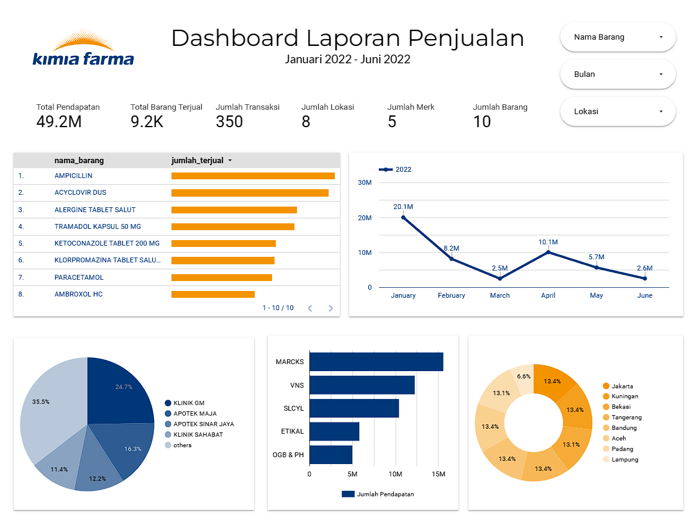

# Dashboard Laporan Penjualan Obat

## Environment I Used

- Looker Data Studio
- SQL (MySQL Workbench)
- Google Slides

## Introduction

As a Big Data Analyst Intern from Kimia Farma, I gained knowledge about data warehouses, data lakes, and data marts through this project. Also, I'm honing my SQL abilities. At the conclusion of the project, I requested that Kimia Farma develop a medicine sales dashboard using Google Data Studio utilizing the following real-world case dataset.

## Dashboard Preview

Link: [Dashboard Laporan Penjualan Obat](https://lookerstudio.google.com/reporting/977a292d-3547-4883-a3f4-7e79c938dce3)

## Resources

You can find the datasets I used in the folder called "dataset" and datamart design in "datamart query design folder".
